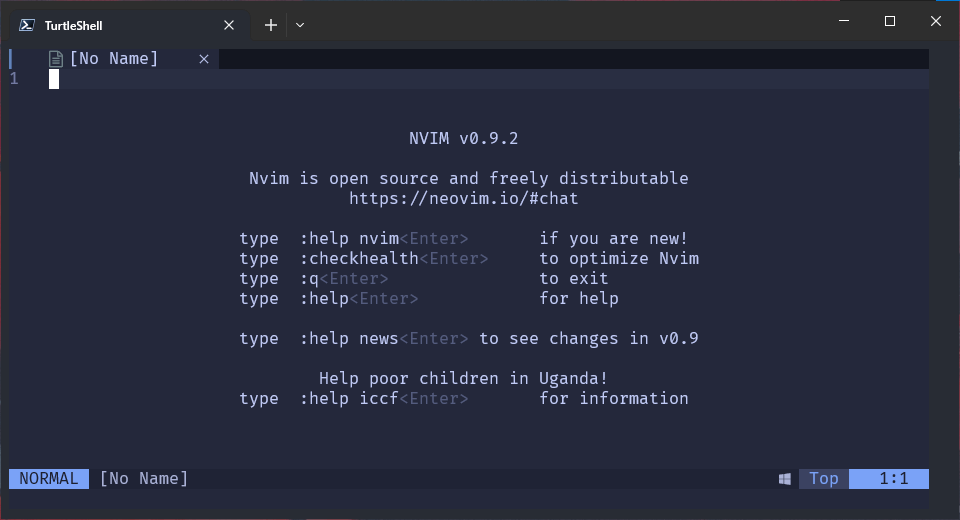

<h1 align="center">⚙dotfiles</h1>

<p align="center">
  
  
  
  
</p>

## Introduction

Opinionated compilation of configuration files and other loosely related items.

## GitHub

- [.gitattributes](.gitattributes)
- [.gitignore](.gitignore)
- [.gitconfig](.gitconfig)

### Add original repo as Upstream Remote

```bash
git remote add upstream <original-repo>.git
```

### Update your fork

```bash
git pull upstream main 
```

## Firefox

### Add Style to Firefox

1. In about:config enable pref toolkit.legacyUserProfileCustomizations.stylesheets
2. Open about:support
3. Click on "Profile Folder" -> "Open Folder"
4. Create a sub-folder named "chrome"
5. Change into the new folder
6. Add files "userChrome.css" "userContent.css"
7. Restart Firefox
8. In Customize... :

- Select Default theme. The color scheme depends on the OS
- Select Compact icons
- Drag Bookmarks Toolbar Items to the left of the address bar. Disable Bookmarks Toolbar

### Add Style to Sidebery

1. Install <https://addons.mozilla.org/firefox/addon/sidebery/>
2. Copy the code from SideberySidebar.css to Sidebery / Settings / Styles editor / Sidebar
3. Copy the code from SideberyGroupPage.css to Sidebery / Settings / Styles editor / Group page
4. Enable the option: Sidebery / Settings / Help / Add preface to the browser window's title if sidebery is active

### Other Notes

- If you need window control buttons - unlock code `Show window buttons - + x`
- If you need an interface in window mode - block the code `Hide interface in window mode`

### Recommended Config Settings

- Opening a bookmark in a new tab
`browser.tabs.loadBookmarksInTabs` `true`
- Open tabs to the right of the current one
`browser.tabs.insertAfterCurrent` `true`
- Scroll step
`mousewheel.min_line_scroll_amount` `25`
- Smoothness of scrolling
`general.smoothScroll.mouseWheel.durationMaxMS` `380`
- Number of recently closed tabs
`browser.sessionstore.max_tabs_undo` `250`
- Disable warning when going to full screen mode
`full-screen-api.warning.timeout` `0`
- Disable add-on recommendations
`extensions.htmlaboutaddons.recommendations.enabled` `false`

## Obsidian

Check out my [Obsidian Starter Vault](https://github.com/semanticdata/obsidian-starter-vault) to get you started with the app.

- [Obsidian Publisher](https://github.com/ObsidianPublisher/obsidian-github-publisher)
- [Configuration](obsidian/obsidian-publisher.json)

## NeoVim

**Configuration** → [init.lua](nvim/init.lua)

**Sync from CLI** → `nvim --headless "+Lazy! sync" +qa`

### Screenshots

| Welcome Screen | Example File |
| -------------- | ------------ |
|  |  |

### Keybindings

| Key Combination | Command |
| --- | --- |
| `<leader>` | `<space>` |
| **Unsorted** |
| `<leader>h` | `^` |
| `<leader>l` | `g_` |
| `<leader>a` | `:keepjumps normal! ggVG<cr>` |
| `gy` | `"+y` |
| `gp` | `"+p` |
| `x` | `"_x` |
| `<leader>e` | `<cmd>NvimTreeToggle<cr>` |
| **Commands** |
| `<leader>w` | `<cmd>write<cr>` |
| `<leader>bq` | `<cmd>bdelete<cr>` |
| `<leader>bl` | `<cmd>buffer #<cr>` |
| `<F2>` | `<cmd>Lexplore<cr>` |
| `<space><space>` | `<F2>` |
| **Telescope** |
| `<leader><space>` | `<cmd>Telescope buffers<cr>` |
| `<leader>?` | `<cmd>Telescope oldfiles<cr>` |
| `<leader>ff` | `<cmd>Telescope find_files<cr>` |
| `<leader>fg` | `<cmd>Telescope live_grep<cr>` |
| `<leader>fd` | `<cmd>Telescope diagnostics<cr>` |
| `<leader>fs` | `<cmd>Telescope current_buffer_fuzzy_find<cr>` |
| **Telescope (builtin)** |
| `<leader>ff` | `builtin.find_files, {}` |
| `<leader>fg` | `builtin.live_grep, {}` |
| `<leader>fb` | `builtin.buffers, {}` |
| `<leader>fh` | `builtin.help_tags, {}` |
| **Normal Mode** |
| `<C-q>` | `:q!<CR>` |
| `<F4>` | `:bd<CR>` |
| **Moving Vertically** |
| `<C-d>` | `<C-d>zz` |
| `<C-u>` | `<C-u>zz` |
| `n` | `nzzzv` |
| `N` | `Nzzzv` |
| **Tab Navigation** |
| `<S-Tab>` | `gT` |
| `<Tab>` | `gt` |
| `<silent <S-t>` | `:tabnew<CR>` |
| **Pane/Window Navigation** |
| `<C-h>` | `<C-w>h` |
| `<C-j>` | `<C-w>j` |
| `<C-k>` | `<C-w>k` |
| `<C-l>` | `<C-w>l` |
| `<C-left>` | `<C-w>h` |
| `<C-down>` | `<C-w>j` |
| `<C-up>` | `<C-w>k` |
| `<C-right>` | `<C-w>l` |
| **Terminal** |
| `<A-t>` | `:sp term://pwsh<cr>i` |
| `tv` | `:lcd %:p:h<CR>:vsp term://pwsh<CR>i` |
| `th` | `:lcd %:p:h<CR>:sp term://pwsh<CR>i` |
| `<Esc>` | `<C-\\><C-n>` |
| `:q!` | `<C-\\><C-n>:q!<CR>` |

### Plugins

| Author/Plugin                                                                                                 | Description                                                          |
| ------------------------------------------------------------------------------------------------------------- | -------------------------------------------------------------------- |
| [akinsho/bufferline.nvim](https://github.com/akinsho/bufferline.nvim)                                         | A snazzy bufferline for Neovim.                                      |
| [akinsho/toggleterm.nvim](https://github.com/akinsho/toggleterm.nvim)                                         | A neovim lua plugin to help easily manage multiple terminal windows. |
| [ap/vim-css-color](https://github.com/ap/vim-css-color)                                                       | Preview colours in source code while editing.                        |
| [editorconfig/editorconfig-vim](https://github.com/editorconfig/editorconfig-vim)                             | EditorConfig plugin for Vim.                                         |
| [folke/tokyonight.nvim](https://github.com/folke/tokyonight.nvim)                                             | Theme                                                                |
| [kyazdani42/nvim-tree.lua](https://github.com/kyazdani42/nvim-tree.lua)                                       | A file explorer tree for neovim written in lua.                      |
| [kyazdani42/nvim-web-devicons](https://github.com/kyazdani42/nvim-web-devicons)                               | Lua "fork" of vim-web-devicons for neovim.                           |
| [lewis6991/gitsigns.nvim](https://github.com/lewis6991/gitsigns.nvim)                                         | Git integration for buffers.                                         |
| [lukas-reineke/indent-blankline.nvim](https://github.com/lukas-reineke/indent-blankline.nvim)                 | Indent guides for Neovim.                                            |
| [numToStr/Comment.nvim](https://github.com/numToStr/Comment.nvim)                                             | Smart and powerful comment plugin for neovim.                        |
| [nvim-lua/plenary.nvim](https://github.com/nvim-lua/plenary.nvim)                                             | All the lua functions I [they] don't want to write twice.            |
| [nvim-lualine/lualine.nvim](https://github.com/nvim-lualine/lualine.nvim)                                     | neovim statusline plugin written in pure lua.                        |
| [nvim-telescope/telescope.nvim](https://github.com/nvim-telescope/telescope.nvim)                             | Find, Filter, Preview, Pick. All lua, all the time.                  |
| [nvim-treesitter/nvim-treesitter-textobjects](https://github.com/nvim-treesitter/nvim-treesitter-textobjects) | Syntax aware text-objects, select, move, swap, and peek support.     |
| [nvim-treesitter/nvim-treesitter](https://github.com/nvim-treesitter/nvim-treesitter)                         | Nvim Treesitter configurations and abstraction layer.                |
| [ThePrimeagen/vim-be-good](https://github.com/ThePrimeagen/vim-be-good)                                       | Nvim plugin designed to make you better at Vim Movements.            |
| [tpope/vim-fugitive](https://github.com/tpope/vim-fugitive)                                                   | A Git wrapper so awesome, it should be illegal.                      |
| [vim-telescope/telescope-fzf-native.nvim](https://github.com/nvim-telescope/telescope-fzf-native.nvim)        | Find, Filter, Preview, Pick. All lua, all the time.                  |
| [wellle/targets.vim](https://github.com/wellle/targets.vim)                                                   | Vim plugin that provides additional text objects.                    |

## License

Source code in this repository is available under the [MIT](LICENSE) license. You are free to use this code however you see fit. That said, some acknowledgement would be well received.
